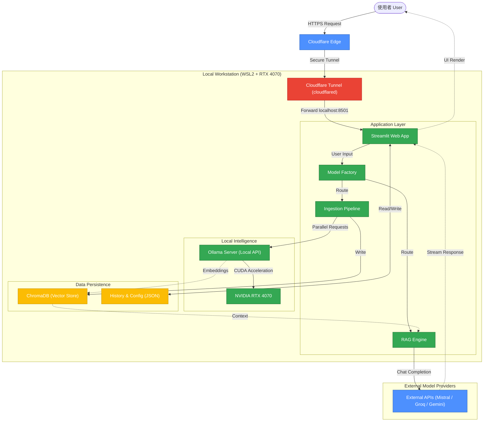

# 🦜 Repo Chat - 開源專案代碼理解助手

**Repo Chat** 是一個基於 **RAG (Retrieval-Augmented Generation)** 技術的 AI 助手，專為閱讀大型 GitHub 開源專案（如 Linux Kernel）而設計。

本專案採用 **「混合雲地架構 (Hybrid Cloud-Local Architecture)」**，將繁重的 Embedding 向量運算留在本地 GPU (RTX 4070) 執行，並透過 **Cloudflare Tunnel** 安全地將服務開放至公網，結合了本地運算的效能與雲端存取的便利性。

> *(在此處貼上你的系統介面截圖)*

---

## ✨ 專案亮點 (Key Features)

* **🚀 自動化專案攝取 (Auto Ingestion)**
    * 支援 Git URL 自動 Clone。
    * 針對大型專案實作 `--depth=1` 淺層複製與 `ThreadPoolExecutor` 平行化向量運算，大幅縮短索引時間。
* **🧠 彈性模型策略 (Flexible Model Strategy)**
    * **Embedding**: 支援本地 **Ollama** (`nomic-embed-text`)，保障隱私且零成本。
    * **Chat**: 支援切換 **Mistral**, **Google Gemini**, **Groq**, 或本地 **Ollama**。
    * **工廠模式**: 底層架構解耦，可輕鬆擴充新的 Model Provider。
* **💎 現代化使用者體驗 (Modern UX)**
    * **Gemini 風格介面**: 極簡側邊欄與 Popover 選單。
    * **串流回應 (Streaming)**: 實作打字機效果。
    * **智慧排序**: 專案列表依「最近使用時間 (MRU)」自動排序。
    * **懸浮按鈕**: JS 注入實作自動偵測閱讀進度，一鍵回到底部。
* **🤝 協作與分享**
    * 生成公開分享連結 (Share Link)，讓他人一鍵匯入對話紀錄。
    * 支援匯出為 Markdown 筆記。
* **🛡️ 資料隱私與持久化**
    * 支援 `.env` 與 UI 設定混合讀取 (Hybrid Config)。
    * 所有向量數據與對話紀錄皆儲存於本地 JSON 與 ChromaDB。

---

## 🏗️ 系統架構 (Architecture)

採用「本地自架 + 邊緣穿透」架構：



---

## 🛠️ 安裝與部署 (Installation)

### 1. 環境準備
本專案建議運行於 Linux 或 WSL2 環境，並具備 NVIDIA GPU 以獲得最佳效能。

* **Python**: 3.10+
* **Ollama**: 請先安裝 [Ollama](https://ollama.com/) 並下載 Embedding 模型：
    ```bash
    ollama pull nomic-embed-text
    ```
* **Git**: 系統需安裝 Git。

### 2. 下載專案
```bash
git clone [https://github.com/your-username/repo-chat.git](https://github.com/your-username/repo-chat.git)
cd repo-chat
```

### 3. 安裝依賴
```bash
# 建立虛擬環境
python -m venv venv
source venv/bin/activate

# 安裝套件
pip install -r requirements.txt
```

### 4. 設定環境變數
複製範本並填入你的 API Keys：
```bash
cp .env.example .env
```

編輯 `.env` 檔案：
```ini
# Chat Models
MISTRAL_API_KEY=your_key
GOOGLE_API_KEY=your_key
GROQ_API_KEY=your_key

# Local Infrastructure
OLLAMA_LLM_URL=http://localhost:11434
```

---

## 🚀 啟動服務 (Usage)

### 方式一：直接啟動
```bash
streamlit run main.py
```

### 方式二：背景服務 (推薦)
使用內附腳本讓服務在背景運行，即使關閉 Terminal 也不會中斷：
```bash
chmod +x run_server.sh
./run_server.sh
```
服務將運行於 `http://localhost:8501`。

### 方式三：公開存取 (Cloudflare Tunnel)
若要讓外部使用者訪問，請設定 Cloudflare Tunnel 指向 `localhost:8501`，並在 UI 的「系統設定」中填入你的公開網址 (Base URL)。

---

## 📂 專案結構

```text
Repo-Chat/
├── main.py              # [Entry Point] 程式入口
├── core/                # [Backend] 核心邏輯
│   ├── ingestion.py     # 資料攝取 (平行化處理)
│   ├── rag.py           # RAG 推論引擎
│   ├── factory.py       # 模型工廠模式
│   └── storage.py       # 資料持久化
└── ui/                  # [Frontend] 介面元件
    ├── sidebar.py       # 側邊欄與設定
    └── chat.py          # 聊天視窗與 JS 互動
```

---

## 📝 License

Distributed under the MIT License.
